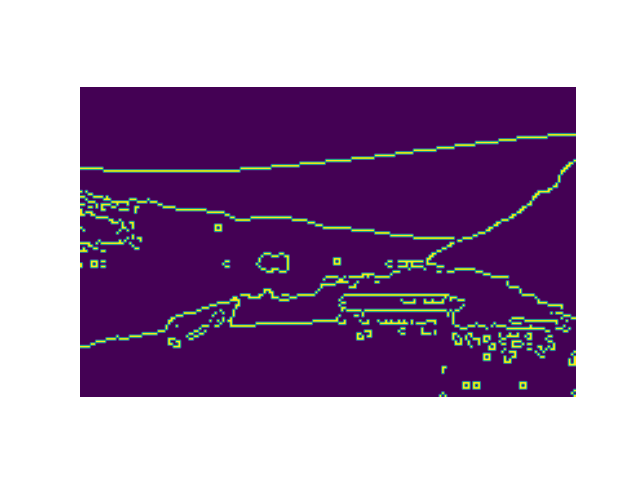
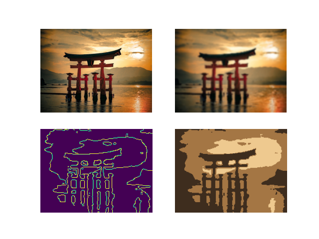

# Comprobo Machine Vision Project
*ENGR 3590: A Computational Introduction to Robotics*

*Christopher Nie*

This project is related to my PIE project, which performs the following actions:

1. Scan an image using a camera
2. Reduce Image to a line drawing
3. Draw this line drawing using a mounted paintball mechanism

The Computer vision aspect of this project is **Step 2: Reduce Image to a line drawing**. The major parts of this task can be broken down as follows: 

- [Identify the "frame of the picture"](#identify-the-frame)
- [Mask out all extraneous elements](#masking)
- [Rotate remaining elemnets](#rotation)
- [Reduce the picture to a line drawing](#picture-to-line-drawing)
- [Putting it all together](#putting-it-all-together)

## Identify the frame <a name="identify-the-frmae"></a>

### Description
Given an image that contains a canvas and a background, identify the canvas. Since the canvas can be any color, and so can the background, image thresholding is not able to accurately identify the canvas. Thus, I opted to find contours using Canny Edge Detection. 

### Methodology

The original methodology used hough line transforms. However, due to many false positive lines, I ended up settling for the Canny Edge Detection method. 

The `detect_paper` module follows the following steps: 

- Find edges using Canny Edge Detection
- Find all contours
- Identify "rectangle-like" contours
- Identify the biggest "rectangle-like" contour

#### Canny Edge Detection  

To prepare for Canny Edge Detection, we simplify the image to `grayscale`. Then, we apply `Gaussian blur` to reduce noise. 


#### Find all Contours

Next, we find the contours using `openCV`'s `findContour` method. This returns a `list` of all `contours` identified in the image. The syntax can be seen as follows: 
```Python
contours, _ = cv2.findContours(img, Mode, Method)
```
I chose to use `cv2.RETR_EXTERNAL` for the `Mode` and `cv2.CHAIN_APPROX_SIMPLE` as the `Method`. `cv2.RETR_EXTERNAL` means that the function will only return the outermost contour in any case of nesting. `cv2.CHAIN_APPROX_SIMPLE` means that the function will only return "keypoints" instead of entire lines. An illustration is shown below, with `cv2.CHAIN_APPROX_NONE` on the left and `cv2.CHAIN_APPROX_SIMPLE` on the right. 


> Although `cv2.CHAIN_APPROX_SIMPLE` is able to approximate here, real world images are not sharp enough to immediately approximate to a rectangle. This method is only taken to reduce data size

#### Rectangle-like Contours <a name="rectangle-like-contours"></a>

To filter out rectangle-like contours, we iterate through every `contour in contours` and approximate the shape using `cv2.approxPolyDP()`. The implimented code looks like this
```Python
arc_length = cv2.arcLength(contour, True)
approx = cv2.approxPolyDP(contour, 0.02 * arc_length, True)
```
`arc_length` is used to find the precision to which the approximated edges must look like a straight line. I found that `0.02` worked best with the test set I was using. 

`approx` is a contour that contains only the edges of the polygon that was approximated. For example, a rectangle would have 4 points, a pentagon would have 5, etc. For our case, we can simply store all contours that have 4 points into a `list` and throw out any contours that do not. 

#### Biggest Rectangle-like Contour

We iterate through our `list` of all "rectangle-like" objects and identify the biggest one through `cv2.contourArea()`. 


## Masking <a name="masking"></a>
### Methodology

First we create white image called `mask`.

With the frame having been identified, we can create the mask using `cv2.drawContours` which takes the syntax
```Python
cv2.drawContours(img, contours, contourIdx, color, thickness)
```
We use the following values: 
- `mask` for `img`
- `max_contour` for `contours`, 
- `-1` for `contourIdx` (which draws all contours in `max_contour`), 
- `(255,255,255)` as `color` (for black)
- `-1` for `thickness` (which fills in the contour)

This draws a black filled in contour onto an otherwise white `mask`. Thus, locations to be excluded are 0, and locations that are to be included are 255. This allows us to perform a `cv2.bitwise_and` operation on the original image and the `mask`. 


### Results
Below are a couple of the images used to test the masking part of this project. Left images are the raw images, while the right images are the masked images. 

<p float="left">
  
   
</p>
<p float="left">
  
   
</p>
<p float="left">
  
   
</p>


## Rotation <a name="rotation"></a>
> This part has been completed after the in-class demo
### Description

Centering and orienting the image is an important part of the ultimate goal of painting a picture off of an image scan. 

### Methodology

We use the keypoints from `approx`, which was mentioned earlier in [Rectangle-like contours](#rectangle-like-contours). These keypoints come in the form 
$$\begin{bmatrix}
x_1 & y_1\\
x_2 & y_2\\
x_3 & y_3\\
x_4 & y_4\\
\end{bmatrix}$$

We find the slope of the keypoints by doing
$$\begin{bmatrix}
\frac{y_1-y_2}{x_1-x_2}\\
\frac{y_2-y_3}{x_2-x_3}\\
\frac{y_3-y_4}{x_3-x_4}
\end{bmatrix}$$

Then, we can take the `arctan` of each row to obtain the angles needed to transform. Since we are dealing with rectangles, we essentially get two angles that are $90\degree$ apart. We take the one with a smaller absolute value (to minimize the total rotation needed), and create a rotation matrix. 

However, before we rotate the image, we need to ensure that the image is properly centered. We can find the center of the contour by using 

```Python
M = cv2.moments(contour)
```
Again, we use the contour of the mask. `M` is a dictionary containing the moments of all contours. We use `M` to create a translation matrix
$$\begin{bmatrix}
1 & 0 & w/2 - x_1\\
0 & 1 & h/2 - y_1\\
\end{bmatrix}$$

Where $w$ and $h$ are the width and height of the image and $x_1$ and $y_1$ are the center coordinates of the mask. 

Finally, we can apply all these transformations through `cv2.warpAffine(img, Matrix, dSize)`, first translating to center the image then rotating to vertical or horizontal. 

### Results
Below are a couple of the images used to test the rotating part of this project. The left is the masked image and the right is the centered and rotated images. 
<p float="left">
   
   
</p>
<p float="left">
   
   
</p>
<p float="left">
   
   
</p>

## Picture to Line Drawing <a name="picture-to-line-drawing"></a>

### Description

Using K-means clustering and Canny edge detection, we can segment an image by color and find the edges of these various groupings. 

### Methodology

We use the following pipeline to process the image: 
- Reduce details / noise
- Apply k-means clustering to segregate objects
- Find object edges with Canny Edge Detection

#### Reduce details / noise
Normally, Canny edge Detection works best with grayscale images. However, K-means clustering groups images based off of color. As such, we cannot perform the grayscale reduction. Instead, we can reduce noise by using `resize` and `GaussianBlur`

**Raw Image**


**Resize only**


**Blur only**


**Both blur and resize**


I opted to use the final de-noising strategy, which involved both blurring and resizing. This gave me the results that best fit the use case, which was to paint a picture using a relatively imprecise instrument, which is a paintball gun. Although I haven't described the full methodology, I will show the results of using *resize only*, *blur only*, and *both blur and resize*. 

**Raw images**

<p float="left">
  
  
</p>

**Resize only, rendered to lines**
<p float="left">
  
  
</p>

**Blur only, rendered to lines**
<p float="left">
  
  
</p>

**Both blur and resize, rendered to lines**
<p float="left">
  
  
</p>
The *resize only* lines still contained a lot of noise, especially in the water. The *blur only* contains highly really accurate line rendition of the image. In fact, for all of my test images, this result came out as arguably the most aesthetic, accurate, and elegant. However, ultimately we are working with an imprecise instrument, and as such, I settled on the line that used *both blur and resize*. This image removes most of the noise from the *resize only* while keeping the lines simple enough to be drawn by the paintball machine. 

#### K-means clustering

**Description**

K-means clustering is an image segmentation strategy that groups pixels into *k* clusters of comparable pixel counts using certain criteria, such as thresholding and proximity. The K-means algorithm itself is a method of vector quantization that is widely applicable to many data forms. [OpenCV's k-means doc](https://docs.opencv.org/4.x/de/d4d/tutorial_py_kmeans_understanding.html) describes the steps to this algorithm. 

Suppose we have a set of data:


1. We want to cluster this into two clusters. Thus, we randomly choose two center points. 
2. We find the distance from each point to any of the two central points, and label it as part of the cluster whose center poitn it is closer to. 


3. Next, we can calculate the mean of the two clusters, and use this mean as the center point of the next cluster. 


4. We repeat steps 2 and 3. Eventually the central points converge to fixed points. These points should be located so that the sum of the distances between each point in the cluster and the corresponding central point is minimized. 


**Methodology**

`OpenCV`'s implementation of the K-means algorithm uses the following syntax: 

```Python
compactness, labels, centers = cv2.kmeans(img, nClusters, criteria, attempts, flags)
```

`img` is the denoised image.\
`nClusters` is one of the more easily tunable parameters that is directly correlated with how many details will show up in the final image. \
`criteria` is a tuple of three parameters, `(type, max_iter, epsilon)` takes three flags for `type`:

- `cv2.TERM_CRITERIA_EPS` -> stop the algorithm if specified accuracy, *epsilon* is reached. 
- `cv2.TERM_CRITERIA_MAX_ITER` -> stops the algorithm after the specified number of iterations, *max_iter*. 
- `cv2.TERM_CRITERIA_EPS + cv2.TERM_CRITERIA_MAX_ITER` -> stops the algorithm when any of the above conditions is met

- I used the final flag with a `max_iter=10` and an `epsilon=1.0`

`attempts` is the number of times the algorithm is executed with a different intial labellings (of which the run with the best compactness is returned). While `max_iter` is used to cut off the algorithm's iterations of step 2 and 3 to prevent an infinite loop, `attempts` is the number of times the algorithm is run with a different initial center points. I ended up settling on `attempts=10`\
`flags` is how the initial center points are taken. I used `cv2.KMEANS_PP_CENTERS` as opposed to `cv2.KMEANS_RANDOM_CNETERS`

**K-value visualization**

k=2 (right); k=3 (left)
<p float="left">
   
   
</p>
k=4 (right); k=5 (left)
<p float="left">
   
   
</p>

We found that `K=3` provided the best balance of detail and simplicity. 

#### Canny Edge Detection

Finally, we put this image through Canny Edge Detection, which will mark out the borders of each segment of the image. 

Referring back to the jet and k-values, we can see what results different k-values provide. 

k=2 (right); k=3 (left)
<p float="left">
   
   
</p>
k=4 (right); k=5 (left)
<p float="left">
   
   
</p>

Although `k=5` here seems to produce a very recognizable image, we found that it cluttered the image too much for more busy images. 

For example, here is a k=5 of the Torii gate. 

 

### Results
In the end, we opted for a `k=3`, which had a better average balance of clarity and clutter. 

*From the top left corner, going clockwise: 1) Raw image 2) De-noising 3) K-means clustering 4) Canny Edge Detection / Final output*

<p float="left">
   
   
</p>

<p float="left">
   
   
</p>

## Putting it All Together <a name='putting-it-all-together'></a>
> This part has been completed after the in-class demo

After wrapping the main elements of this projects into their respective functions, I was able to set up `main.py` to properly pipeline the images together. 

*left: raw image, right: line drawing rendering*

<p float="left">
   
   
</p>

The program properly masks, rotates, and renders an image into a line drawing that can be sent to another program to do the drawing. 

### Running 
Run `main.py` on a given image with filename `filename`. 
```Bash
python3 main.py filename
```

Run `detect_paper.py` to remove the background of an image with filename `filename`
```Bash
python3 detect_paper.py filename
```


Run `process_image.py` to render an image with filename `filename` into a line drawing. 
```Bash
python3 process_image.py filename 
```

To render an image with filename `filename` into a line drawing without the image resizing (full accuracy), the user can run
```Bash
python3 process_image.py filename False
```

# Reflection

Overall, I learned a lot about manipulating Python structures, and was able to glimpse many different sorts of techniques. Furthermore, one lesson I took away was keeping the goal in sight. Although I was able to recreate a line image that could almost 1:1 copy the image's details and intricacies, ultimately I was working with a paintball gun, and not a laser cutter. Thus I decided to go with the more practical line drawing. 

The canvas detector was much more work than I anticipated. I originally tried using Hough lines, but was unable to detect the rectangle. Even the current rectangle detector falls prey to common weakness such as lighting and background patterns. 

With that being said, improving this canvas detector would probably be the first step to greater robustness. However, another interesting way that the project can be improved is by adding live camera footage. Currently, the program takes a still image, and I do wonder whether live camera footage would improve the experience and perhaps even help with the canvas detection. 